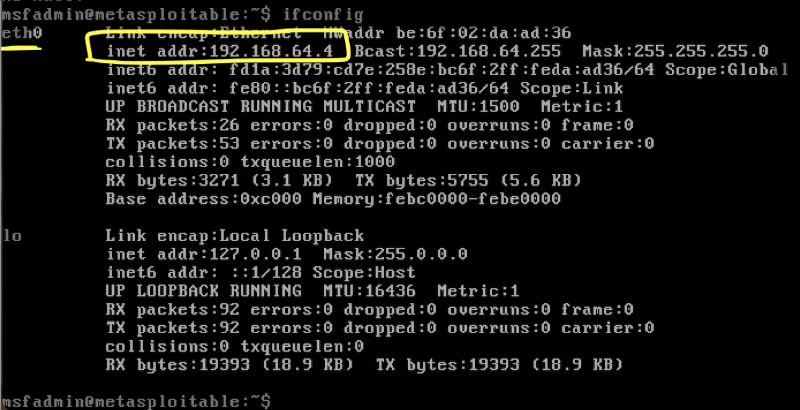

# Metasploit Resource Script to Automate Finding Relevant Exploits for Penetration Tests

https://github.com/misakitanabe/mastery_extension

## Background

Metasploit is a powerful and widely used opensource framework designed for penetration testing, cybersecurity research, and ethical hacking. It provides tools to identify, exploit, and test vulnerabilities in computer systems. At its core, Metasploit helps security professionals simulate real world attacks to assess the security posture of networks and applications. When used manually, Metasploit operates through a command line interface or a graphical interface, where the user selects or searches for specific exploits prepackaged code designed to take advantage of known vulnerabilities.

The process typically involves four steps:

1. loading an exploit module based on the target's vulnerabilities
2. configuring the exploit with required parameters like the target's IP address and port
3. selecting a payload, which is the code that runs after the exploit succeeds (e.g., opening a backdoor or providing shell access)
4. executing the exploit to test if the system is vulnerable.

## Motivation

One of the key benefits of using resource scripts in Metasploit is the ability to automate repetitive tasks, like the first step of finding relevant exploits for a target system. Resource scripts are files that can include embedded Ruby code along with Metasploit commands, allowing for dynamic and customizable automation.

For example, instead of manually searching through the vast library of exploits to match specific vulnerabilities or CVEs, a resource script can use Ruby logic to automatically load the database, filter vulnerabilities based on specific criteria, and crossreference them with known exploits. This automation streamlines the workflow, allowing penetration testers to focus more on analyzing results and refining attack strategies rather than spending time on manual searches.

Additionally, resource scripts ensure consistency in multistep processes, making it easier to replicate tests across multiple systems or teams. By combining the powerful exploit matching capabilities of Metasploit with the flexibility and logic of embedded Ruby code in resource scripts, security professionals can quickly and accurately identify exploitable weaknesses in a network.

## Contribution

My resource script aims to automate the first step outlined in the background, "loading an exploit module based on the target's vulnerabilities". Here are the general steps it takes in the script:

1. Uses Nmap to scan the target IP

   ```
   run_single("db_nmap -sV --script vulners -T4 -n #{$target_ip}")
   ```

- Finds open ports and the services they are running
- Scans for vulnerabilities

2. For each vulnerability found, collects list of CVEs that are associated

   ```
   def collect_cves()
       print_status "Extracting vulnerabilities and corresponding ports..."
       vulns = []

       framework.db.services.each do |service|
           vulns_for_service = { host: service.host.address, port: service.port, service: service.name, name: "", cves: [] }

           service.vulns.each do |vuln|
               vuln.refs.each do |ref|
                   if ref.name =~ /^CVE/
                       vulns_for_service[:cves] << ref.name
                       vulns_for_service[:name] = vuln.name
                   end
               end
           end

           # Add the collected vulnerabilities for this service if there are any CVEs
           vulns << vulns_for_service unless vulns_for_service[:cves].empty?
       end
       print_line ""
       vulns
   end
   ```

3. Maps found CVEs to exploits

   ```
   def find_exploits(vulns)
       # Add exploits corresponding to the extracted vulnerabilities to the array
       if vulns.any?
       matched_modules = []
       vulns.each do |vuln|
           print_status("Trying to find exploit for vuln: '#{vuln[:name]}', port: '#{vuln[:host]}:#{vuln[:port]}', service: '#{vuln[:service]}'")
           found_exploit = false

           framework.exploits.each_module do |name, mod|
               mod_instance = framework.modules.create(name)
               if mod_instance && mod_instance.references
                   mod_instance.references.each do |ref|
                       if vuln[:cves].any? { |cve| ref.site.include?(cve) } && !matched_modules.any? { |exploit| exploit[:module] == name}
                           print_status("\tFound exploit module #{name} for CVE: #{ref}")
                           print_status("\t#{mod_instance.description}")

                           matched_modules << { module: name, host: vuln[:host], port: vuln[:port], os: vuln[:os] }
                           found_exploit = true
                           # break
                       end
                   end
                   # break if found_exploit
               end
           end

           if !found_exploit
               print_status("No exploit found for #{vuln[:host]}:#{vuln[:port]}\n")
           end
       end
       else
           print_status "No vulnerabilities found for services."
       end

       if !matched_modules.empty?
           print_status "Found a total of #{matched_modules.length} exploits for #{$target_ip}"
       else
           print_status "Found no exploits for #{framework.db.hosts[0]}"
       end
   end
   ```

   - Iterates through every single exploit in Metasploit's Database, and stores exploits that have a reference to any CVE found in previous step

4. Outputs description of any exploits found

   Example portion of output:

   ```
   [*] Trying to find exploit for vuln: 'cpe:/a:apache:http_server:2.2.8', port: '192.168.64.4:80', service: 'http'
   [*] Found exploit module multi/http/apache_normalize_path_rce for CVE: https://nvd.nist.gov/vuln/detail/CVE-2021-41773
   [*]
   This module exploit an unauthenticated RCE vulnerability which exists in Apache version 2.4.49 (CVE-2021-41773).
   If files outside of the document root are not protected by ‘require all denied’ and CGI has been explicitly enabled,
   it can be used to execute arbitrary commands (Remote Command Execution).
   This vulnerability has been reintroduced in Apache 2.4.50 fix (CVE-2021-42013).
   ```

## How to get Started (instructions only for Mac OS X)

> If you are interested, please use script in an environment under your control and at your own risk.

1. Install Metasploit
   - https://docs.metasploit.com/docs/using-metasploit/getting-started/nightly-installers.html#installing-metasploit-on-linux--macos
2. Install Nmap
   - With Homebrew:
     - `brew install nmap`
   - From Nmap website:
     - https://nmap.org/download.html#macosx
3. In terminal, run msfconsole
   - `/opt/metasploit-framework/bin/msfconsole`
   - Enter 'y' for both questions to add msfconsole to default PATH and to automatically set up database.
4. Ensure Msf DB is connected to PostgreSQL:
   - `db_status`
     - Output should say: "Connected to msf. Connection type: postgresql"
   - `exit`
5. In normal terminal, clone repo
   - `git clone https://github.com/misakitanabe/mastery_extension.git`
6. Install Metasploitable
   - Metasploitable is an intentionally vulnerable virtual machine that you can use to test Metasploit on. We will use this as our target for our script.
   - https://www.rapid7.com/products/metasploit/metasploitable/
7. Get IP address of Metasploitable

   - Login to Metasploitable with user: msfadmin, pass: msfadmin
   - `ifconfig`
   - The address "192.168.64.4" is the target IP we will be using to pass in to the script. Ensure you replace it with your Metasploitable's IP

    

8. Run script
   - `msfconsole -r find_exploits.rc [TARGET_IP]`

## Understanding the Output

**For every vulnerability that has CVE references found on the target machine, the script will output one of two things.**

1. If it was unable to find any exploits with that CVE, it will output:

   ```
   [*] Trying to find exploit for vuln: 'cpe:/a:proftpd:proftpd:1.3.1', port: '192.168.64.4:2121', service: 'ftp'
   [*] No exploit found for 192.168.64.4:2121
   ```

   - The first line describes the vulnerability found on what port and service on the host. More information on the vulnerability can be found by searching the name of the vulnerability, in this case 'cpe:/a:proftpd:proftpd:1.3.1' in a browser.
   - The second line explains that we did not find any exploits with a matching CVE number.

2. If it was able to find any exploits with that CVE, it will output:

   ```
   [*] Trying to find exploit for vuln: 'cpe:/a:apache:http_server:2.2.8', port: '192.168.64.4:80', service: 'http'
   [*] Found exploit module multi/http/apache_normalize_path_rce for CVE: https://nvd.nist.gov/vuln/detail/CVE-2021-41773
   [*]
   This module exploit an unauthenticated RCE vulnerability which exists in Apache version 2.4.49 (CVE-2021-41773).
   If files outside of the document root are not protected by ‘require all denied’ and CGI has been explicitly enabled,
   it can be used to execute arbitrary commands (Remote Command Execution).
   This vulnerability has been reintroduced in Apache 2.4.50 fix (CVE-2021-42013).
   ```

   - The first line describes the vulnerability found on what port and service on the host. More information on the vulnerability can be found by searching the name of the vulnerability, in this case 'cpe:/a:apache:http_server:2.2.8' in a browser.
   - The second line will output the name of the exploit found, along with the CVE reference.
   - Lastly, it output a description about the exploit.

**There will be a brief summary at the end of the output outlining how many exploits were found for host**

```
[*] Found a total of 1 exploits for 192.168.64.4
[*] Searching for relevant exploits completed in 147 seconds.
```

## Analysis of Script Result

Using Metasploitable as my target, I was able to find one exploit that had a corresponding CVE to a vulnerability found from the Nmap scan. Being able to find any exploits is good progress, but given how there are many more vulnerabilities in Metasploitable, ideally the script should return many more exploits. Here are some improvements I can think of for future work:

- On top of finding vulnerabilities using Nmap, execute auxiliary modules from Metasploit based on open ports to find more vulnerabilities.
  - Consider using a more comprehensive vulnerability scan tool and import those results in addition
- Use another metric to match exploits with vulnerabilities/services on top of using just CVE numbers.
  - Some Metasploit exploits have a check() function, that checks whether that target could be likely exploited by that exploit or not. Instead of just matching based on CVE's, the script could run the check() function for all exploits against target host and collect those.
- Factor in target system's operating system to ensure the exploit would be compatible with that target. Exploits contain information on what operating systems it works on, so cross check that the target would indeed be vulnerable to that exploit.
  - Nmap has an option to retrieve target system's operating system. We could use this to cross check.
